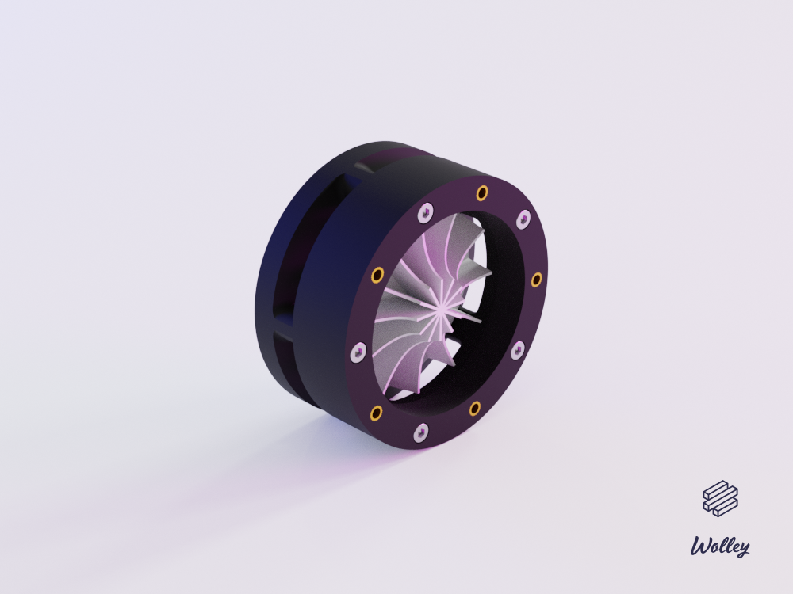

The Mechanical Project for the Wolley Fan Module
================================================

A centrifugal fan with built-in motor and controller.

Parts
-----

### 3D Printable

| Qty | Part        |
| ---:| ----------- |
|   1 | Back        |
|   1 | Spacer      |
|   1 | Front       |
|   1 | Impeller    |

### Other Parts

| Qty | Part                                  |
| ---:| ------------------------------------- |
|   5 | Socket Screw ISO 4762 - M3x30mm       |
|  10 | M3 Threaded Insert (Ruthex RX-M3x5.7) |
|   1 | DC Motor (ex. Mabuchi RS-385PV-2465)  |
|   1 | ECU (Wolley MotorECU)                 |

How to Build
------------

1. Print all 3D printable parts in PLA with 0.25 mm layer height.
2. Sandpaper the parts slightly and make sure they were printed as intended.
3. Assemble it according to explosion drawing.